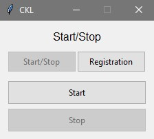
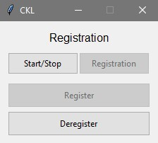

# Custom Keyboard Lighting App

This app provides a means for custom RGB lighting for SteelSeries keyboards via the [GameSense SDK](https://github.com/SteelSeries/gamesense-sdk). Run `gui.pyw` to launch a gui which can send events to the keyboard. The app will appear as **Custom Keyboard Lighting** in Engine's 'Apps' menu (do not change any settings in the app in Engine). To remove the app from Engine, navigate to the *Registration* page of the gui and click the *Deregister* button.

**NOTE:** The custom keyboard effects will timeout after not receiving any events for 15 seconds. So, after stopping or exiting the gui, the keyboard will return to its profile after 15 seconds.

## Table of Contents
1. [Requirements/Installation](#requirementsinstallation)
2. [How-to](#how-to)
    - [The GUI](#the-gui)
    - [Writing Custom Lighting Effects](#writing-custom-lighting-effects)
3. [Keyboard Bitmap-key Reference](#keyboard-bitmap-key-reference)

## Requirements/Installation

1. [SteelSeries Engine](https://steelseries.com/engine)
2. After downloading Engine, ensure that the file `coreProps.json` is located at `%PROGRAMDATA%\SteelSeries\SteelSeries Engine 3\`
3. [Python](https://www.python.org/) (developed in [Python 3.9.6](https://www.python.org/downloads/release/python-396/))

Once Python is installed, use the package manager **pip** to install the following packages by enterring the following lines in a python terminal.

1. [TKinter](https://docs.python.org/3/library/tk.html) (if not installed during Python install) - used for the GUI
```bash
pip install tk
```

2. [Requests](https://docs.python-requests.org/en/master/) - used for HTML post to the GameSense API
```bash
pip install requests
```

All other packages used are included in the Python STL

## How-To

### The GUI


- **Start/Stop**
    * **Start**: Loop game events to the keyboard
    * **Stop**: Stop looping game events to the keyboard


- **Registration**
    * **Register**: Register the application to SteelSeries Engine Apps (this action is performed automatically each launch)
    * **Deregeister**: Remove the application from SteelSeries Engine Apps

The app is registered to Engine upon launch. To remove the app, simply navigate to the Registration page and click the *Deregister* button. If you launch the app again, it will be re-registered to Engine.

### Writing Custom Lighting Effects 

Lighting effects are communicated to the keyboard via a bitmap, which is a list of 132 lists containing RGB values, each of those list corresponding to one cell of a grid of size 22x6. That grid is superimposed onto the keyboard, with each cell representing one 'key' (see [Keyboard Bitmap-key Reference](#keyboard-bitmap-key-reference) below). Changing the lighting algorithm and creating custom effects can be done with minimal python knowledge by modifying `sendGameEvent` function in the *engine_app.py* file. 

I have tried to include each possible method of communication with the API as a function inside the *engine_app* class so that knowledgable users could use the class as a jumping off point for more complex apps. If you would like to understand more about the methods in the *engine_app* class, review the [GameSense SDK documentation](https://github.com/SteelSeries/gamesense-sdk).

**WARNING**: Occasionally, communication with the API gets buggy. If you find that you are changing the effects but they are not reflected accurately on the keyboard, deregister the app from Engine, change the `self.game` member variable in *engine_app.py* from the string 'CUSTOM_KEYBOARD_LIGHTING' to something else (limited to uppercase A-Z, 0-9, hyphen, and underscore characters) and try again. If the problems still persist, try changing the `self.game` and `self.event` variables to something else (following the same naming rules).

If you meet all the installation requirements, and you've modified *engine_app.py*, you can use your new algorithm simply by running *gui.pyw* and clicking Start. Below, I will break down the required/recommended code for lighting algorithms using this app in hopes that it will give you some insight into writing your own effects.

```python
def sendGameEvent(self, args, kill_switch):
    endpoint = f'{self.sseAddress}/game_event'
    frame = self.bitmap
    payload = {
        "game": self.game,
        "event": self.event,
        "data" : {
            "value" : 100,
            "frame" : {
                "bitmap" : frame
            }
        }
    }

    ...
    
    with requests.Session() as s:
        while not kill_switch.is_set():
            
            ...

            s.post(endpoint, json=payload)
            if kill_switch.is_set(): break
            sleep(0.01)
```
`endpoint = f'{self.sseAddress}/game_event` and `payload = {...}` This code identifies the API endpoint to send data to and it sets up the proper payload to deliver to that endpoint. Each endpoint has a specific json payload requirement. Refer to the [GameSense SDK documentation](https://github.com/SteelSeries/gamesense-sdk) to learn more about communicating with the API via json. 

`frame = self.bitmap` I chose to keep an empty bitmap as a member variable and instead use/modify the variable `frame` so that each time I start sending events, I begin with an empty bitmap. You could simply modify and send the `self.bitmap` variable if you wanted some kind of persistent effect.

`with requets.Session() as s:` This line opens a session with the API (refer to the [requests reference](https://docs.python-requests.org/en/master/user/advanced/) for more information about this package).

`while not kill_switch.is_set():` The kill switch is set when either the 'Stop' button is pressed or the gui is closed, so game events will be continuously sent to the API inside this while loop until either of those actions.

`s.post(endpoint, json=payload)` This code posts the payload to the API endpoint. This line of code should be placed wherever you would like to send a lighting frame to the API. Think of the lighting effects as an animation, this code marks one frame of that animation.

`if kill_switch.is_set(): break` You will want to place this code at some point in your algorithm as an exit point for when the 'Stop' button is pressed or the gui is closed. Without this line, your algorithm will continue through until the while loop is evaluated before stopping.

`sleep(0.01)` This line is not strictly necessary, but some sort of delay is recommended, otherwise the custom lighting app will eat up CPU quickly.

## Keyboard Bitmap-key Reference

Below is a mapping between the bitmap (a list of 132 lists representing 132 cells in a 22x6 grid) and their corresponding keys on an Apex 5 (or similar) keyboard. These indices in the bitmap can be altered to change the lighting of any one key.

```python
''' APEX 5 VALID KEYS '''
valid_keys = [
    0,2,3,4,5,6,7,8,9,10,11,12,13,15,16,17,22,23,24,25,26,27,28,29,
    30,31,32,33,34,35,37,38,39,40,41,42,43,44,45,46,47,48,49,50,51,
    52,53,54,55,56,57,59,60,61,62,63,64,65,67,68,69,70,71,72,73,74,
    75,76,77,79,84,85,86,88,90,91,92,93,94,95,96,97,98,99,100,104,
    106,107,108,109,110,111,112,116,120,121,122,123,125,126,127,129,130
]

''' APEX 5 KEY MAPPING '''
bitmap = [
    [0,0,0], # 1    # ESC
    [0,0,0], # 2    #
    [0,0,0], # 3    # F1
    [0,0,0], # 4    # F2
    [0,0,0], # 5    # F3
    [0,0,0], # 6    # F4
    [0,0,0], # 7    # F5
    [0,0,0], # 8    # F6
    [0,0,0], # 9    # F7
    [0,0,0], # 10   # F8
    [0,0,0], # 11   # F9
    [0,0,0], # 12   # F10
    [0,0,0], # 13   # F11
    [0,0,0], # 14   # F12
    [0,0,0], # 15   # 
    [0,0,0], # 16   # PRTSC
    [0,0,0], # 17   # SCRLK
    [0,0,0], # 18   # PAUSE
    [0,0,0], # 19   # 
    [0,0,0], # 20   # 
    [0,0,0], # 21   # 
    [0,0,0], # 22   # 
    [0,0,0], # 23   # `
    [0,0,0], # 24   # 1
    [0,0,0], # 25   # 2
    [0,0,0], # 26   # 3
    [0,0,0], # 27   # 4
    [0,0,0], # 28   # 5
    [0,0,0], # 29   # 6
    [0,0,0], # 30   # 7
    [0,0,0], # 31   # 8
    [0,0,0], # 32   # 9
    [0,0,0], # 33   # 0
    [0,0,0], # 34   # -
    [0,0,0], # 35   # =
    [0,0,0], # 36   # BACKSPACE
    [0,0,0], # 37   # 
    [0,0,0], # 38   # INS
    [0,0,0], # 39   # HOME
    [0,0,0], # 40   # PGUP
    [0,0,0], # 41   # NUM
    [0,0,0], # 42   # NUMPAD /
    [0,0,0], # 43   # NUMPAD *
    [0,0,0], # 44   # NUMPAD -
    [0,0,0], # 45   # TAB
    [0,0,0], # 46   # Q
    [0,0,0], # 47   # W
    [0,0,0], # 48   # E
    [0,0,0], # 49   # R
    [0,0,0], # 50   # T
    [0,0,0], # 51   # Y
    [0,0,0], # 52   # U
    [0,0,0], # 53   # I
    [0,0,0], # 54   # O
    [0,0,0], # 55   # P
    [0,0,0], # 56   # [
    [0,0,0], # 57   # ]
    [0,0,0], # 58   # \
    [0,0,0], # 59   # 
    [0,0,0], # 60   # DEL
    [0,0,0], # 61   # END
    [0,0,0], # 62   # PGDN
    [0,0,0], # 63   # NUMPAD 7
    [0,0,0], # 64   # NUMPAD 8
    [0,0,0], # 65   # NUMPAD 9
    [0,0,0], # 66   # NUMPAD +
    [0,0,0], # 67   # CAPS
    [0,0,0], # 68   # A
    [0,0,0], # 69   # S
    [0,0,0], # 70   # D
    [0,0,0], # 71   # F
    [0,0,0], # 72   # G
    [0,0,0], # 73   # H
    [0,0,0], # 74   # J
    [0,0,0], # 75   # K
    [0,0,0], # 76   # L
    [0,0,0], # 77   # ;
    [0,0,0], # 78   # '
    [0,0,0], # 79   # 
    [0,0,0], # 80   # ENTER 
    [0,0,0], # 81   # 
    [0,0,0], # 82   # 
    [0,0,0], # 83   # 
    [0,0,0], # 84   # 
    [0,0,0], # 85   # NUMPAD 4
    [0,0,0], # 86   # NUMPAD 5
    [0,0,0], # 87   # NUMPAD 6
    [0,0,0], # 88   # 
    [0,0,0], # 89   # L-SHIFT
    [0,0,0], # 90   # 
    [0,0,0], # 91   # Z
    [0,0,0], # 92   # X
    [0,0,0], # 93   # C
    [0,0,0], # 94   # V
    [0,0,0], # 95   # B
    [0,0,0], # 96   # N
    [0,0,0], # 97   # M
    [0,0,0], # 98   # ,
    [0,0,0], # 99   # .
    [0,0,0], # 100  # /
    [0,0,0], # 101  # R-SHIFT
    [0,0,0], # 102  # 
    [0,0,0], # 103  # 
    [0,0,0], # 104  # 
    [0,0,0], # 105  # U-ARROW
    [0,0,0], # 106  # 
    [0,0,0], # 107  # 1
    [0,0,0], # 108  # 2
    [0,0,0], # 109  # 3
    [0,0,0], # 110  # NUMPAD ENTER
    [0,0,0], # 111  # L-CTRL
    [0,0,0], # 112  # L-WINDOWS
    [0,0,0], # 113  # L-ALT
    [0,0,0], # 114  # 
    [0,0,0], # 115  # 
    [0,0,0], # 116  # 
    [0,0,0], # 117  # SPACE
    [0,0,0], # 118  # 
    [0,0,0], # 119  # 
    [0,0,0], # 120  # 
    [0,0,0], # 121  # R-ALT
    [0,0,0], # 122  # R-WINDOWS
    [0,0,0], # 123  # STEELSERIES
    [0,0,0], # 124  # R-CTRL
    [0,0,0], # 125  # 
    [0,0,0], # 126  # L-ARROW
    [0,0,0], # 127  # D-ARROW
    [0,0,0], # 128  # R-ARROW
    [0,0,0], # 129  # 
    [0,0,0], # 130  # NUMPAD 0
    [0,0,0], # 131  # NUMPAD .
    [0,0,0]  # 132  # 
]
```
